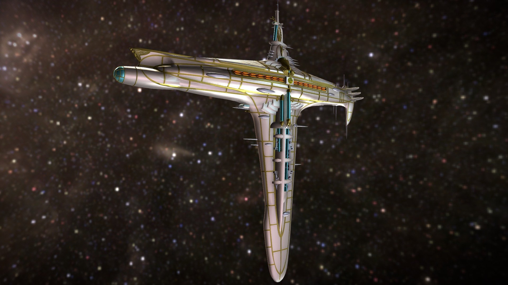

# **🚀 Spaceship Titanic - Passenger Transport Prediction**

## **📌 Project Overview**
In this competition, the objective is to **predict whether a passenger was transported to an alternate dimension** during the *Spaceship Titanic's* collision with a spacetime anomaly. 

To achieve this, I will explore the dataset, perform statistical analysis, and build machine learning models to maximize prediction accuracy. 

Our goal is to **submit predictions to Kaggle** and achieve a **score of 0.79 or above**.

---

## **🎯 Objectives**
This notebook focuses on the following **key machine learning and data science tasks**:
- **Perform Exploratory Data Analysis (EDA)** 📊
- **Train various machine learning models** 🤖
- **Build ensemble models** 🏗️
- **Optimize models using hyperparameter tuning** 🔧
- **Use AutoML tools for model selection** ⚡
- **Visualize data with Matplotlib & Seaborn** 🎨

---

## **📊 Dataset Description**
The dataset contains **personal records** from passengers aboard the Spaceship Titanic. The data includes details such as **age, spending habits, home planet, VIP status, and transportation outcome**.

### **🔹 Files & Columns**
#### **1️⃣ train.csv**
Used for training models (~8700 passengers).
- **PassengerId** - Unique ID for each passenger, formatted as `gggg_pp` (group and passenger number).
- **HomePlanet** - Planet of residence.
- **CryoSleep** - Whether the passenger was in cryosleep.
- **Cabin** - Cabin number (`deck/num/side` format).
- **Destination** - Planet the passenger was heading to.
- **Age** - Age of the passenger.
- **VIP** - Whether the passenger paid for VIP services.
- **RoomService, FoodCourt, ShoppingMall, Spa, VRDeck** - Spending amounts on amenities.
- **Name** - Passenger's first and last name.
- **Transported** - Target variable (`True` = transported, `False` = not transported).

#### **2️⃣ test.csv**
Used for making predictions (~4300 passengers).
- Contains the same features as `train.csv`, except **Transported** (which needs to be predicted).

#### **3️⃣ sample_submission.csv**
- A sample submission file with the expected format (`PassengerId` and `Transported`).

---

### **📌  Notes**
The main study is done in the `space_titanic_notebook.ipynb`, but I have done some extra EDA in a secondary notebook `feature_correlation_exploration.ipynb`. The reader can go through this one or not, as I have taken the main conclusions of it to the main notebook. The reaason behind splitting this was to make the main notebook more digestible and easier for the reader. I have also created a separated file `helper_functions.py` where I am defining all functions that I used in the `feature_correlation_exploration.ipynb` so I can use them in the main notebook without having to define them again.  

---
### **🚀 Result**
The approach followed achieved an accuracy score of 80.2%
